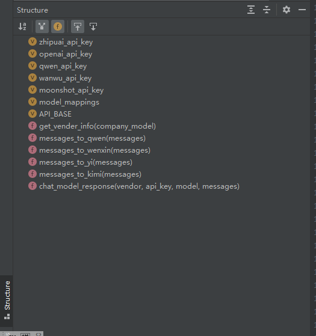
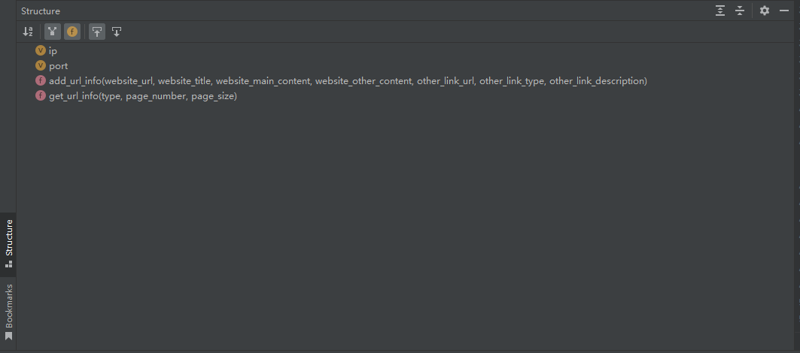

# 爬虫文档

## 1. 爬虫代码结构

### 1.1. 整体目录结构

- 实际如图所示：

  

-  整体目录结构如下：

  ~~~
  scrapy_hzcu:
    - c1_model：模型API_KEY，模型调用封装
    - c2_handle_data：数据处理：url到html,html到text，删除英文字符，让模型读取url/image链接
    - c3_api：数据处理好后，提交到服务器API，从服务器查询对应的数据
    - main.py：整个爬虫-提交服务器-从服务器拉数据的流程
    - test.py：小功能点的测试
  ~~~

---

### 1.2. 细化代码结构 

#### 1.2.1. c1_model：

- 实际如图所示：

  

- 整体目录结构如下：

  ~~~
  - api_key：zhipu,openai,qwen,01wanwu,moonshot
  - model_mappings：厂商模型对应的厂商，模型型号，模型API_Key
  - messages_to_qwen..：不同厂商的模型多轮对话时，对话模板适配
  - chat_model_response：通过厂商，api_key，模型，对话信息，返回模型的对话
  ~~~

  

---

  

#### 1.2.2. c2_handle_data:

- 实际如图所示：

  

- 整体目录结构如下：

  ~~~
  - html_from_url：输入url，返回对应html页面
  - text_from_html：输入html，提取对应的text文本（包括图像链接，网站链接）
  - remove_english_characters...：删除text文本中的英文字符
  - title_from_model：模型从text文本中总结标题
  - url_from_model：模型从text文本中总结url
  - image_from_model：模型从text文本中总结图像url
  - json_from_model_response：将模型总结的字符串转换为json格式
  ~~~

  

---

  

#### 1.2.3. c3_api：

- 实际如图所示：

  

- 整体目录结构如下：

  ~~~
  - ip：服务器公网地址
  - port：服务器后端端口
  - add_url_info：将单个页面抓取的数据，提交到服务器上
  - get_url_info:从服务器上拉去网站信息，图片信息
  ~~~

  

---

  

#### 1.2.4. main.py

- 实际如图所示：

  

- 整体目录结构如下：

  ~~~
  - 1. url到文本：c2_handle_data
  - 2. 提取主体内容/标题/网站链接/图片链接：c2_handle_data
  - 3. 提交到服务器：c2_handle_data中add_url_info方法使用
  - 4. 从服务器获取数据：c2_handle_data中get_url_info方法使用
  ~~~

  

---

  

### 1.3 爬取单页面代码的流程

- 主要就是main.py函数
  - url到文本
  - 提取文本内容/标题/网站链接/图片链接
  - 提交到服务器
  - 从服务器获取数据
- 可以修改以处理其他异常：
  - 模型处理的提示词：c2_handel_mode: __init__.py
  - 变更不同的模型：main.py

## 2. 提交和查询API使用

### 2.1 数据库设计

- 实际如图所示：

  

- 说明：

---

  

### 2.2 APIFox的链接及使用说明

- 链接：[APIFox链接]( https://apifox.com/apidoc/shared-8c931bd6-b3d7-45c2-bf4f-e892af79ee9d/api-158935828) 【请点击查看，上传和拉取数据的API】

- 上传爬取数据到服务器API：

  

- 从服务器拉取数据的API：

  

### 2.3 python代码样例

- 上传爬取数据到服务器

  

  ~~~
  说明：一个网页中主要包括url，网站主题，网站主要内容，网站其他内容，其他网站链接，其他网站描述
  必须输入参数是该网站的url,该网站的标题，该网站的主要内容
  如果该类型为网站，则other_link_descriptions则是链接网站的主题
  如果该类型为图片，则other_link_descriptions则是链接图片的描述
  ~~~

- 从服务器拉取数据

  

     ~~~~
  说明：输入参数主要包括类型，页数，页大小
  类型包括：website（网站）, image（图像）, file（文件）, other（其他）
  页数默认为1，页大小默认为1页10条记录
     ~~~~

  

