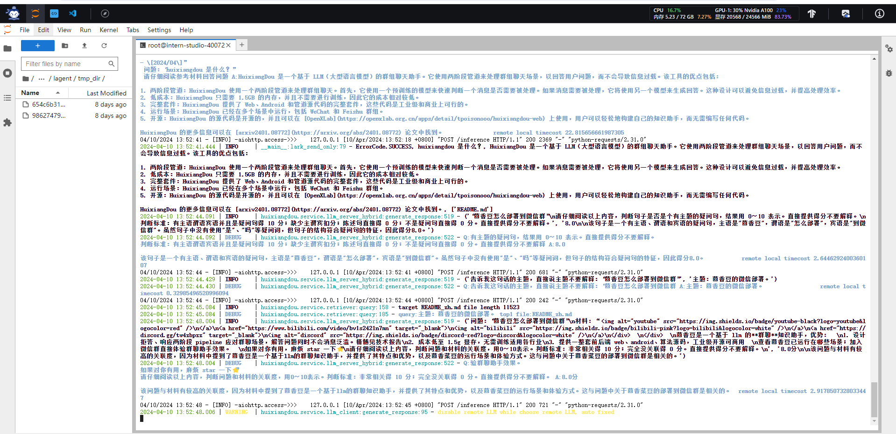

# 第3课茴香豆RAG

## 1. 在茴香豆Web版创建自己领域的知识问答助手

1. 笔记：

   ~~~
       RAG（Retrieval Augmented Generation）技术，即是检索增强生成技术。主要包括检索和生成两个部分。主体的技术框架主要是LangChain和LlamaInde。在LangChain中，主要包括文档加载，文档切分，向量存储到向量库，问题向量化召回，模型回答等部分。在LangChain中各个模块又包含各种组件，比如Embedding模型，在社区支持中，可以选择OpenAI的或者智源的Embedding模型。
       对于RAG的增强，则可根据问答历史，重写检索问题。同时，对于检索的模块，可以采用bge的重排模型进行排序，提升回答准确性。
       对于RAG的评测，可以采取传统的一些如准确率，召回率等评估指标；同时可以结合RGB，RECALL基准评测，以及RAGAS,ARES,TruLens等评测工具进行评测。同时，充分利用大模型评分与少量人工评分，进行评分模型选型和评分提示词的优化。
       茴香豆是一款RAG的开源软件，主要优点在于可以接入微信，飞书等IM消息平台，同时也支持联网查询。
   ~~~

   

2. 截图：

   - 对话1

     

   - 对话2

     

     

     

## 2. 在 `InternLM Studio` 上部署茴香豆技术助手

1. 笔记：

   ~~~
   	在InterLM Studio上部署茴香豆技术助手主要包括环境配置，使用茴香豆RAG助手，茴香豆进阶。其中，结合自己业务场景，主要是在RAG的组件选型中，例如嵌入模型，向量数据库，重排模型的选择上进行测试。通过网络搜索增强系统的知识边界，使用不同的模型API，测试准确率，并根据性能和成本，进行具体的选型。
   	茴香豆对我的项目的参考价值，主要在于两点。1是拒答模块，2是接入IM平台。书写对应的拒答问题到向量数据库，通过语义检索，判别是否拒答，会在后续的项目中展示。接入IM平台，主要是能够切入实际的应用场景，针对我当前业务的平台注册/申请，平台使用等用户常见的问题，进行回答，从而展示实际价值。
   ~~~

2. 截图：

   

